# Dumpster Diving
## Overview
**Description:**
Aiya. I accidentally deleted the flag when cleaning up my Desktop.

**Flag Format:** SIBER25{flag} 
**Zip Password:** - 
**Challenge Creator:** @identities

## Solution
I was provided with **Dumpster Diving.ad1 & Dumpster Diving.ad1.txt** disk images (.ad1).

**ad1 file** can be open with FTK Imager such as Exterro FTK Imager, AccessData FTK Imager and etc.

> _FTK Imager_ is a forensic imaging and analysis tool designed to acquire, create forensic images, and perform detailed analysis of various types of digital media.

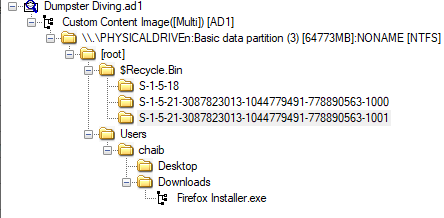

Based on the challenge description, the challenge creator hinted the flag file are accidently deleted. I assume the flag file will either be inside the **/Desktop** or **$RECYCLE.BIN**.
After I take a look around the common directories like **Desktop, Download, Documents** and etc. I found strange folder called **S-1-5-21-3087823013-1044779491-778890563-1001** inside **$RECYCLE.BIN**.

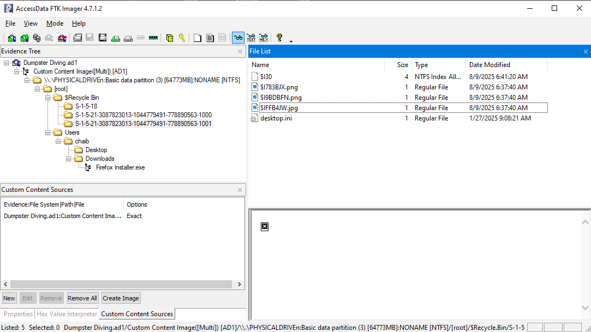

I found a multiple images deleted inside the file. 

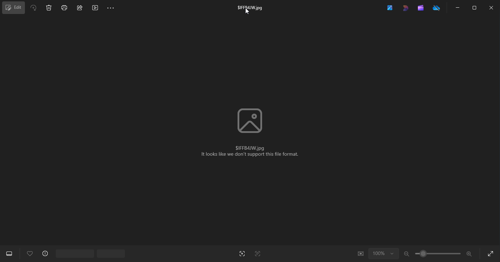

I tried to export the images but the photo turns out corrupted. I took initiative to inspect the file and attempt to recover the images. I utilized [hexed.it](https://hexed.it/) to view raw binary data and hex value. Finally, we found the flag.

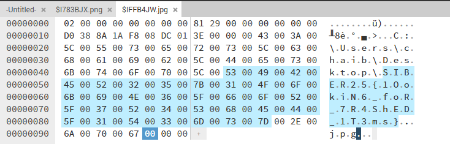

I used additional step to carefully extract the flag using custom python script. This python script used to **convert hex value to ascii char**.

```python
arr = bytes([
    # Offset 0x0000004A to 0x0000008C
    0x53, 0x00, 0x49, 0x00, 0x42, 0x00, 0x45, 0x00, 0x52, 0x00, 0x32, 0x00,
    0x35, 0x00, 0x7B, 0x00, 0x31, 0x00, 0x4F, 0x00, 0x6F, 0x00, 0x6B, 0x00,
    0x69, 0x00, 0x4E, 0x00, 0x36, 0x00, 0x5F, 0x00, 0x66, 0x00, 0x6F, 0x00,
    0x52, 0x00, 0x5F, 0x00, 0x37, 0x00, 0x52, 0x00, 0x34, 0x00, 0x53, 0x00,
    0x68, 0x00, 0x45, 0x00, 0x44, 0x00, 0x5F, 0x00, 0x31, 0x00, 0x54, 0x00,
    0x33, 0x00, 0x6D, 0x00, 0x73, 0x00, 0x7D, 0x00  #
])

def bytes_to_ascii(byte_arr):
    return byte_arr.decode('utf-16le')

print(bytes_to_ascii(arr))
```

**Flag:** SIBER25{1OokiN6_foR_7R4ShED_1T3ms}
# Breached
## Overview
**Description:**
Data Lab Logistics Management Holdings Limited has been attacked. The attacker used Windows privilege escalation and got access to sensitive passwords. Your goal is to find the following information and submit as flag. (1) Which Windows privilege token did the attacker use? (2) Which account has the plaintext password 8675309? (3) What is the plaintext password that is used for more than one account? (4) What is the plaintext password for the Administrator account?

**Flag Format:** SIBER25{SeImpersonatePrivilege_sum.ting.wong_ReusingPassword101_AdminPassword} 
**Zip Password:** - 
**Challenge Creator:** @identities

## Solution
The challenge attached a 7z file contain **.ad1 and .ad2 disk image file**.
Based on my understanding, the flag here constructed based on chained-analysis on the case. I decided to deconstruct the problem into smaller, easier piece of problem.
**Goal:**
1. Which Windows privilege token did the attacker use?
	- **Locate** strange file inside the disk image, prioritize common path such as **Temp, Downloads, Desktop, Document**. 
	- **Analysis** on payloads or exploit downloaded or used by the attacker.
	- **Identify** the "Windows Privilege token".
2. Which account has the plaintext password 8675309?
	- **Create** a custom script to convert plaintext to hash
	- **Convert** plaintext password `8675309` into NTLM hash
	- **Match** the generated hash with exposed credential file or exposed hash.
3. What is the plaintext password that is used for more than one account?
	- **Locate** the credential file that stored multiple account credential.
	- **Identify** duplicate user credential, or hashes.
	- **Crack** the duplicate hash to identify the plaintext password
4. What is the plaintext password for the Administrator account?
	- **Locate** the credential file that stored multiple account credential.
	- **Identify** Administrator credential, or hash.
	- **Crack** the administrator credential hash.
### GOAL 1: Which Windows privilege token did the attacker use?
I start by scanning through the directories and files inside the disk images, look for a strange files inside the disk image. I prioritize common path used by attacker such as **Temp, Downloads, Desktop, Documents, and etc.** I found multiple files which suspected used or generated by the attacker inside **/Temp** folder.

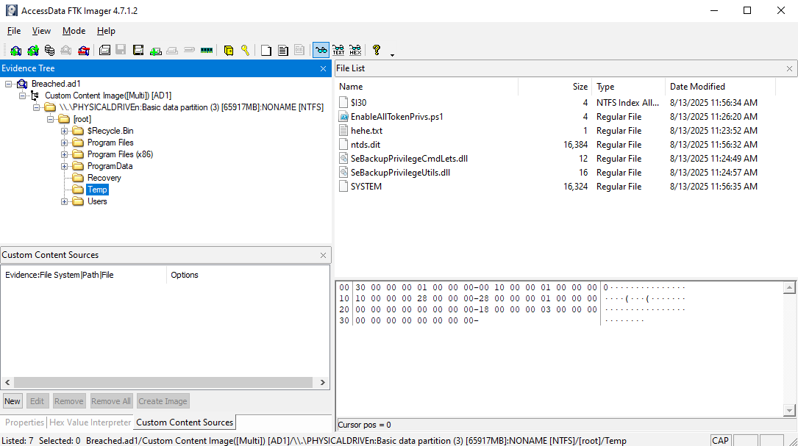

I found multiple files including **ntds.dit, SYSTEM, hehe.txt, EnableAllTokenPrivs.ps1 and a few .dll** . The **ntds.dit** and **SYSTEM** are sensitive file and not supposed to be there. I believe the attacker extracted this files using the payload **EnableAllTokenPrivs.ps1**. 

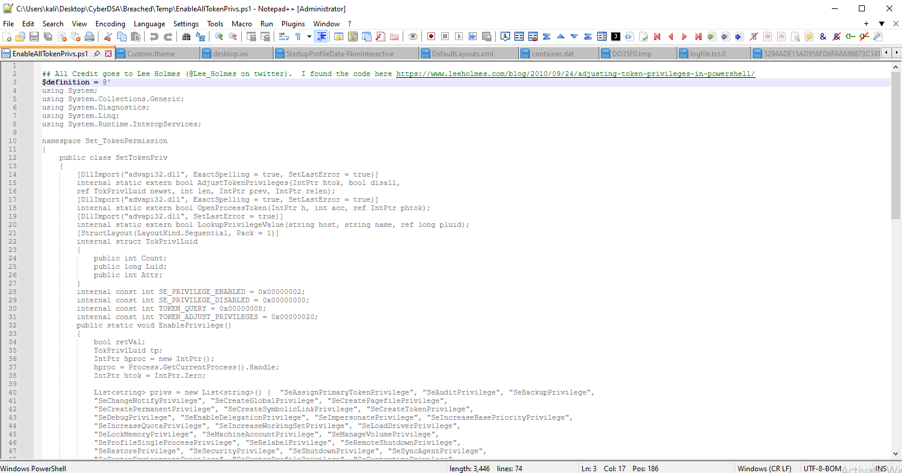

DLL present: **SeBackupPrivilege** token found inside the Temp file
	- SeBackupPrivilegeCmdLets.dll
	- SeBackupPrivilegeUtils.dll
	- 
In **hehe.txt**: the text script used wbadmin backup command to expose C: drive as another volume (E:). Which classic SeBackupPrivilege abuse.

Attacker backup protected file (**ntds.dit and SYSTEM**) without needing direct admin access.
So, the mystery 1 is solved. The answer is `SeBackupPrivilege`.

### GOAL 2: Which account has the plaintext password 8675309?
Using protected file (**ntds.dit and SYSTEM**) extracted by attacker with the help of **impacket-secretdump**, I able to obtain dumped credentials.

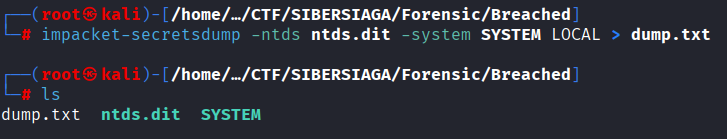

So, I already have the dump file of the credentials. I only have to get the NTLM hash of password `8675309`. I calculate the password hash using custom python script (credit to my partner-in-crime: *ChatGPT* for creating this script).

```python
from Crypto.Hash import MD4

def ntlm_hash(password: str) -> str:
    # NTLM uses UTF-16LE encoding
    pw_bytes = password.encode('utf-16le')
    md4_hash = MD4.new()
    md4_hash.update(pw_bytes)
    return md4_hash.hexdigest().upper()

if __name__ == "__main__":
    password = "8675309"
    hash_value = ntlm_hash(password)
    print(f"Password: {password}")
    print(f"NTLM Hash (Hashcat mode 1000): {hash_value}")
```

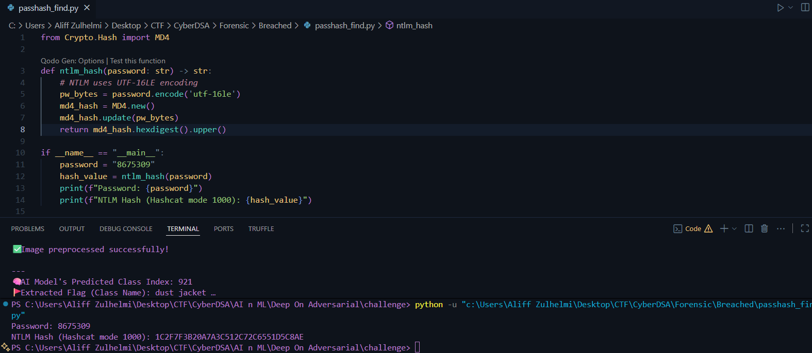

Then, I got the NTLM hash for `8675309` : 1c2f7f3b20a7a3c512c72c6551d5c8ae
I searched for this hash inside the **dump file** and voilaa, found it!

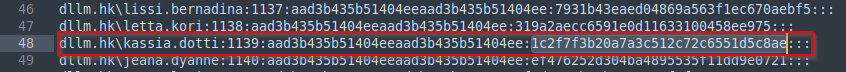

So, we got the answer, the password is belong to: `dllm.hk\kassia.dotti`
### GOAL 3: What is the plaintext password that is used for more than one account?
Since, the plaintext password is used by multiple account, the NTLM hash will be the same too. So, I craft a command to get duplicate hashes inside `dump.txt` (credit to my partner-in-crime: *ChatGPT*).

```bash
awk -F: 'NF>=4 {print tolower($4)}' dump.txt | sort | uniq -d
```

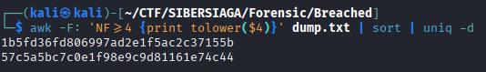

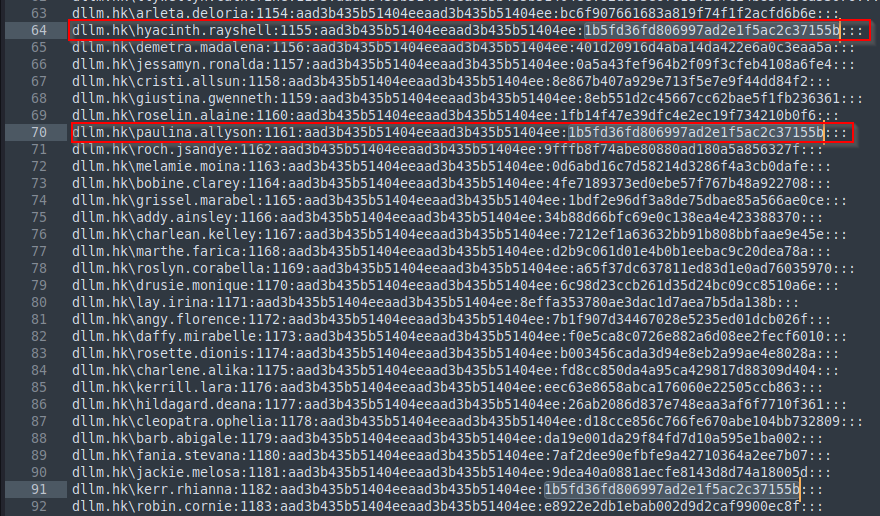

As I can see, there's 3 different account that have duplicate hash. I cracked the hash using **hashcat** and discover the plaintext password.

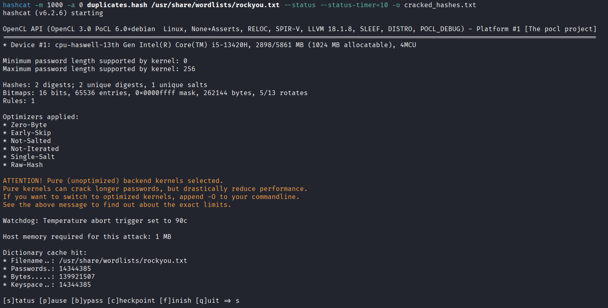

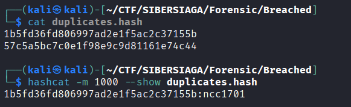

Answer: `ncc1701`
### GOAL 4: What is the plaintext password for the Administrator account?
All I have to is, find the hashes begin with **"Administrator"**, put it in different file and crack it with **hashcat**. I just took admin hash inside the `dump.txt` file, insert into `admin.hash`. Then, I got the plaintext.

```bash
"Administrator:500:aad3b435b51404eeaad3b435b51404ee:cf3a5525ee9414229e66279623ed5c58:::" > admin.hash

hashcat -m 1000 -a 0 admin.hash /usr/share/wordlists/rockyou.txt
```

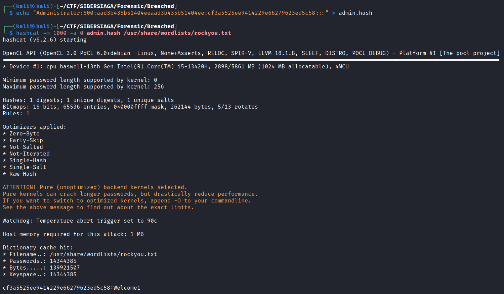

Answer: `Welcome1`

Finally, I craft the flag combining all answer I got, and I got the flag:
Flag: `SIBER25{SeBackupPrivilege_kassia.dotti_Welcome1_ncc1701}`
# View Port
## Overview
**Description:**
Oops. I accidentally deleted the flag when cleaning up my Desktop.

Flag Format: SIBER25{flag} 
Zip Password: -
Challenge Creator: @identities
## Solution
I don't really able to connect on behavior relation between "View Port" and deleted files as mention in description and title, but I able to locate anomalies in the image file given, which super-deep subdirectories given inside `Users/chaib/AppData`.

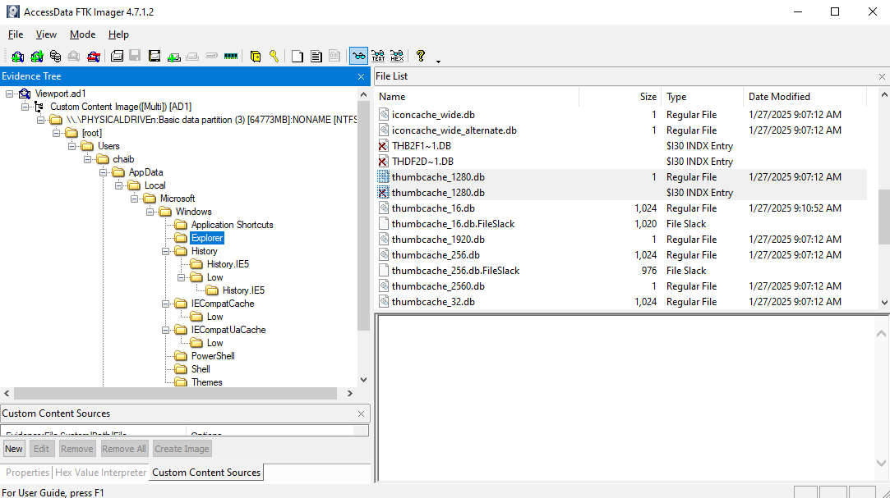

I try to understand what's the objective of the challenge. I been enumerating the possible place the might store a piece of artifact of user deleted files. I narrowed my scope down to `Explorer` folder.

After a long research, I discovered that this directories stored `Iconcache.db` and `Thumbcache.db`.
		- **Iconcache.db** = Stores program icons for user applications.
		- **Thumbcache.db** = Store preview images (thumbnails) of media files like images and videos.

My theory here, the **media files is deleted and overwrite**, but the preview images (**thumbnail**) of the media files is still stored inside thumbnail and icon cache database.

So, I enumerate the **thumbcache.db** and **iconcache.db**, since there's multiple type of this database, So I prioritize based on their sizes.

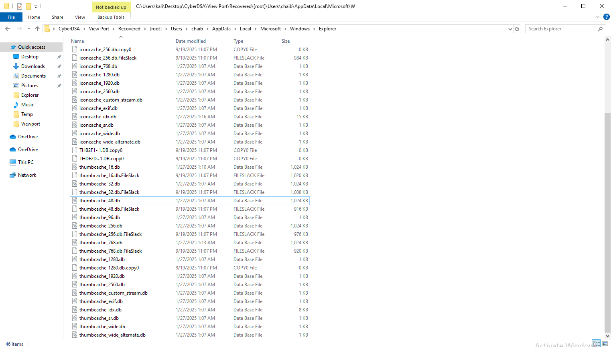

I view content of `thumbcache.db` and `iconcache.db` files using [Thumbs Viewer](https://thumbsviewer.github.io/). After a long open and close a photo, I found the flag inside `thumbcache_48.db`. The flag scatter into many pieces inside `.bmp` files.

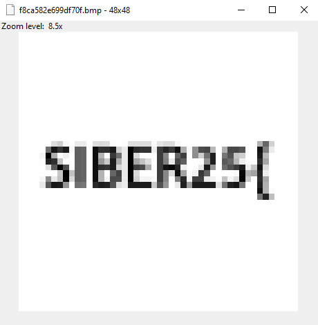
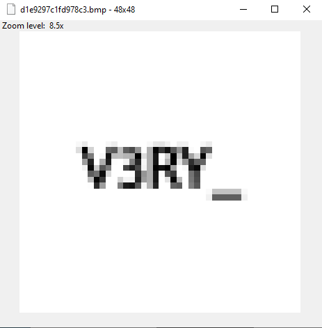
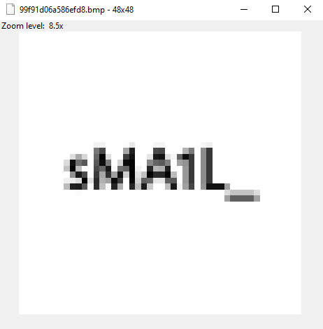
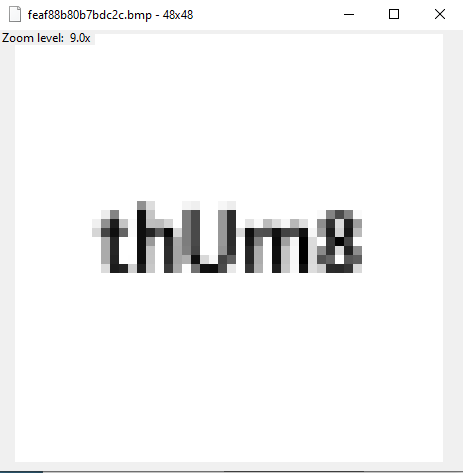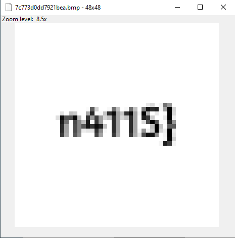
So the flag is `SIBER25{V3RY_sMA1L_thUm8n411S}`