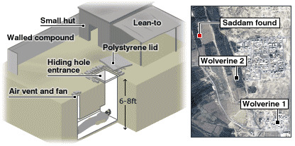

# OSINT

## Challenge Name: We got him!

**Description:**&#x20;

Your agency has intercepted a picture of a dead drop, located the location of the given picture to intercept the drop.

Note when submitting the flag include 5 digits of precision past the decimal for example if the photo was taken at (-100.123456,99.212121) , submit "SSMCTF{-100.12345,99.21212}".&#x20;

NOTE: There no rounding off

<figure><figcaption></figcaption></figure>

### Solution

Based on this picture, I was able to catch the context and the person of interest. The context is operation to caught Saddam Hussein, a deposed president of Iraq. After a lot of research on Saddam Hussein's capture operation, Operation Red Dawn. I able to match and locate precisely the point of interest.

<figure><figcaption></figcaption></figure>

Flag: SSMCTF{34,474,43.781}
