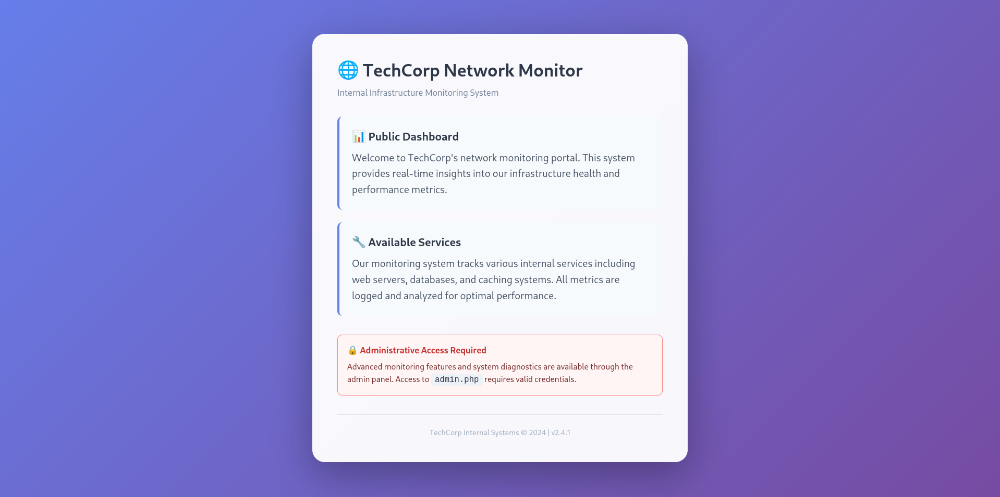

# REUNION CTF 2025

## PHP-Redis&#x20;

<figure><figcaption></figcaption></figure>

**Description**: Get the flag plzz!!

### Summarize

The challenge have a critical vulnerability chain involving **authentication bypass**, **argument injection**, and **server-side request forgery (SSRF)**.&#x20;

The **apache conf** is configured to protects **admin.php** using **\<Files "admin.php">**. Somehow, due to the way **apache** interact with php-fpm handler via the **\<FilesMatch ".+.php$">**. Nerdly speaking, we can bypass this using a path info add-on to the file name, it's already enough to bypass the authentication process.

Once we inside the admin dashboard (**admin.php**)**,** it provide as a diagnostic interface that exec **curl** via php **exec()** function. Even the system sanitizes the value, it still allow user to control the command argument (param). This allow us to utilize curl features such as **-o** to output to file and **-K** to read arguments from a config file.

The script also try to restrict user to **http** and **https** protocol only. Smh, we can skip the validation using **-K** argument. This allow us to use non-standard protocol like **dict://** to interact with internal services. Which basically **SSRF**.

### Dashboard Authentication Bypass

<figure><figcaption></figcaption></figure>

<figure><figcaption></figcaption></figure>

At a glance, we served by an index page. It hinted an admin page at `admin.php` . However, when we navigate to the admin page, it prompt  for credential. Luckily, we were given a source code for this challenge, and based on the source code the creds are randomly generated and strong against bruteforce. So instead, we can look for misconfiguration and vulnerability.

<figure><figcaption></figcaption></figure>

Since the web using **PHP-FPM,** php script execution happened on PHP-FPM docker. So we can use `admin.php%3f.php` payload to bypass the authentication process due to basename mismatch, and the file being treated as `admin.php`  at **PHP-FPM** due `tocgi.fix_pathinfo` treated `%3f.php`  as path info instead of exact path.

<figure><figcaption></figcaption></figure>

Now we successfully get unauthenticated access to the admin dashboard. Now can we perform an enumeration to discover services, and loophole inside the internal network.

### Argument Injection via CURL & SSRF

`admin.php` provides us a diagnostic interface that executes the `curl` command via php `exec()` . However, it attempt to sanitize the values using `escapeshellarg()`. It look safe, but it doesn't. Why? Because it generally stop a **command injection** but we can still manipulate the existing command using **argument injection** due to curl vary option of argument. Our interesting flag here is `-o` and `-K`&#x20;

* -o = output to file / write a file
* -K = follow instruction in a specific config file

exploit.conf content:\
.png>)

<figure><figcaption></figcaption></figure>

```
curl -s -X POST "http://5.223.57.169:8080/admin.php%3f.php" \
     -d "action=ping" \
     -d "url=<MALICIOUS CONFIG CONTENT>" \
     -d "opt=-o" \
     -d "data=POST"
```

Malicious config #1 successfully written in **/tmp/POST\_b8c37c61768890c2**

<figure><figcaption></figcaption></figure>

```
curl -s -X POST "http://5.223.57.169:8080/admin.php%3f.php" \
     -d "action=ping" \
     -d "opt=-K" \
     -d "data=/tmp/POST_b8c37c61768890c2"
```

Then we can run the custom instruction to test SSRF to redis server.

### Flag Extraction

flag.conf content:&#x20;

.png>)

To extract the flag, we can just modify the payload to run `get flag` on redis server. This can done using other malicious config file. We just have to repeat the previous step and using different payload.

<figure><figcaption></figcaption></figure>

```
curl -s -X POST "http://5.223.57.169:8080/admin.php%3f.php" \
     -d "action=ping" \
     -d "url=<FLAG EXTRACTION CONFIG CONTENT>" \
     -d "opt=-o" \
     -d "data=POST"
```

We can see the `flag.conf` successfully written in tmp as `POST_29a2dd1dd850d54d`.&#x20;

Now, we only have to execute it.

<figure><figcaption></figcaption></figure>

```
curl -s -X POST "http://5.223.57.169:8080/admin.php%3f.php" \
     -d "action=ping" \
     -d "opt=-K" \
     -d "data=/tmp/POST_29a2dd1dd850d54d"
```
